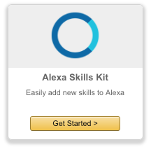
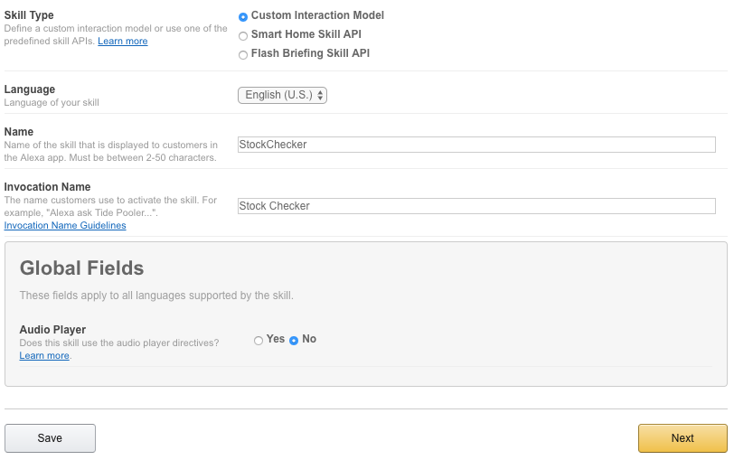
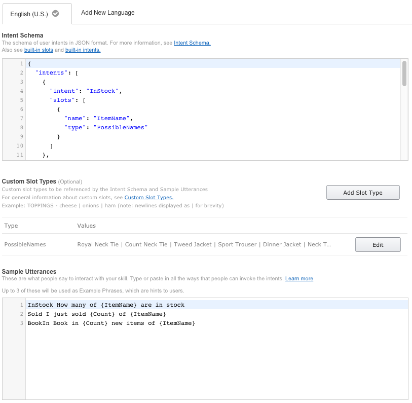
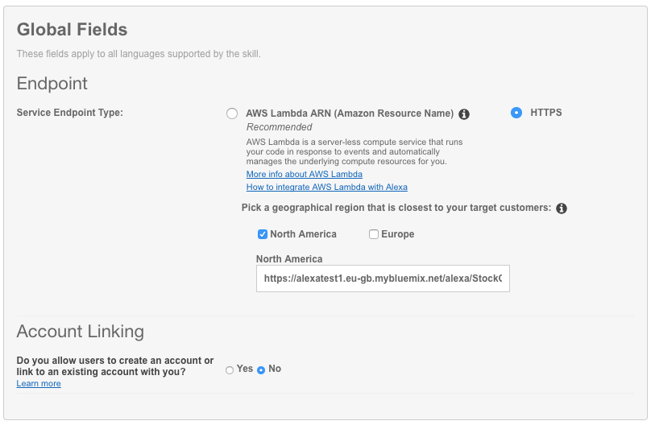
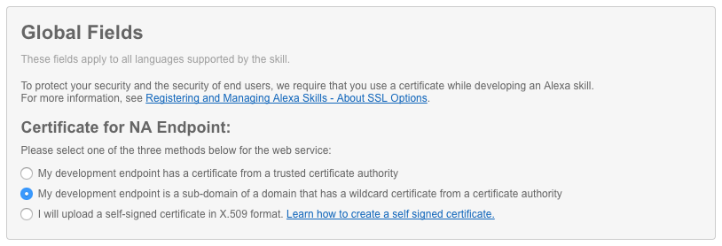
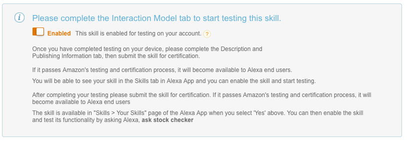
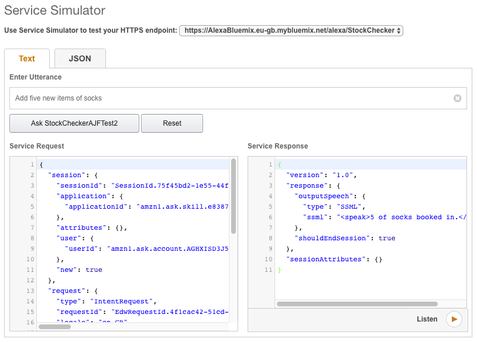

# IBM Bluemix Alexa Integration

### Summary
This Backend for Frontend template uses a **LoopBack** Node.js runtime with the **Cloudant NoSQL DB** service on Bluemix to support and illustrate a scenario supporting an Amazon Alexa skill for a retail scenario. The template exhibits common architectural design patterns that developers can use to model their backend on Bluemix to support integration for a voice-driven skill application. It has the ability to "add", "sell", and "check" products' stock levels.

The backend uses the following Bluemix services and runtime:

**Runtime**
* **Node.js** for supporting Alexa skill integration.

**Services**
* **Cloudant NoSQL DB** to hold a list products in a NoSQL database.

## Configuring the Backend

The backend can be easily installed using the **bluegen** command line tool. This CLI tool logs you into Bluemix and prepares the backend services for use. It automatically provisions the services and populates them with the test data required to get up to speed quickly.

### Before you begin
Ensure that you have:

* An IBM Bluemix Account. You can sign up for a free account at <http://bluemix.net/>.

* The [Cloud Foundry CLI tool](https://github.com/cloudfoundry/cli) installed.

* A Node.JS runtime and the npm tooling [installed locally](https://nodejs.org/en/download/package-manager/).

* An Amazon Developer account for Alexa. If you don't have one, navigate to <https://developer.amazon.com/edw/home.html#/> to set one up. You should use the same Amazon account that's associated with your Alexa device(s) you want to test the skill on.

* The [Bluemix Generator CLI tool](https://www.npmjs.com/package/bluemix-generator) installed by typing the command:

	`npm install -g bluemix-generator`

> **Note:** If you have issues installing these packages globally, it is likely an issue with your permissions. See the [official npm instructions for how to fix permission issues](https://docs.npmjs.com/getting-started/fixing-npm-permissions) in their **Getting Started**.

### Create your backend from this template

1. First, clone this project into your working directory:

	`git clone https://github.com/ibm-bluemix-mobile-services/bluemix-alexa-stockchecker.git`

2. Run the following command in the root directory of your cloned project. This will create the required services on Bluemix and populate them with the necessary test data:

	`bluegen`

3. Navigate to your newly created projects folder (`projects/<whatevernameyougavethebackend>`). If you are interested, you will find a file called `README-HOWITWORKS.md` that explains how the generated application works and how to test it locally.

4. Upload your backend to Bluemix by typing these commands:

	`cf login [-a API_URL] [-u USERNAME] [-o ORG] [-s SPACE]`

	`cf push`

   After running `cf push`, you should be able to see the application running on the Bluemix dashboard. Visiting the application route will greet you with a landing page displaying more information about this template and the ability to explore the API.

### Setting up the Alexa Skill in the Amazon Developer Console

Instructions for setting up the skill in the Amazon Developer Console

1. Once you've signed up or logged in, open the Alexa Skills Kit:

    

1. On the next page, click "Add a new skill":

    

1. Fill out the "Skill Information" page like this. You will need to pick a unique name for the skill as Amazon requires that they are unique. You might like to prefix it with your company name or your initials:

    

1. Fill out the interaction model page like this (to populate the Intent Schema, the Custom Slots, and the Sample Utterances, you can use the files `intentSchema.json`, `customslots.txt` (with a ‘type’ of `PossibleNames`), and `sampleUtterances.json` respectively from the `skill-metadata/` subdirectory of the generated application - you should be able to use these unchanged):

    

   Hit Next.

1. Fill out the configuration tab like this:

    

1. You need to change the service endpoint to match the hostname you deployed earlier, i.e.: <http://yourhostname.mybluemix.net/alexa/StockChecker/>.

1. Pick "My development endpoint is a sub-domain of a domain that has a wildcard certificate from a certificate authority" and click "Next":

    

1. On the next panel, make sure testing is enabled:

    

### Testing the Skill in the Amazon Developer Console

Now you can test! Flip to the testing panel, and enter utterances:

Some example utterances to try:

* "Add five extra socks"
* "What's the stock level of trousers?"
* "Sell four shirts"

### Testing with a Real Alexa Device

There's actually nothing else you need to do to test with a real Alexa device (Echo or Echo Dot), assuming your Alexa device is associated with the same Amazon ID you've used to set up the Skill. Your skill will simply appear automatically on your device, using whatever Invocation Name you defined when you set up the skill. Try the same utterances as above, e.g.:

* "Alexa, ask Stock Checker to add five extra socks"
* "Alexa, ask Stock Checker what's the stock level of trousers?"
* "Alexa, ask Stock Checker to sell four shirts"

You can also say:

* "Alexa, open Stock Checker", then...
* "Alexa, add five extra socks"

### License
This package contains sample code provided in source code form. The samples are licensed under the Apache License, Version 2.0 (the "License"). You may obtain a copy of the License at http://www.apache.org/licenses/LICENSE-2.0 and may also view the license in the license file within this package.
